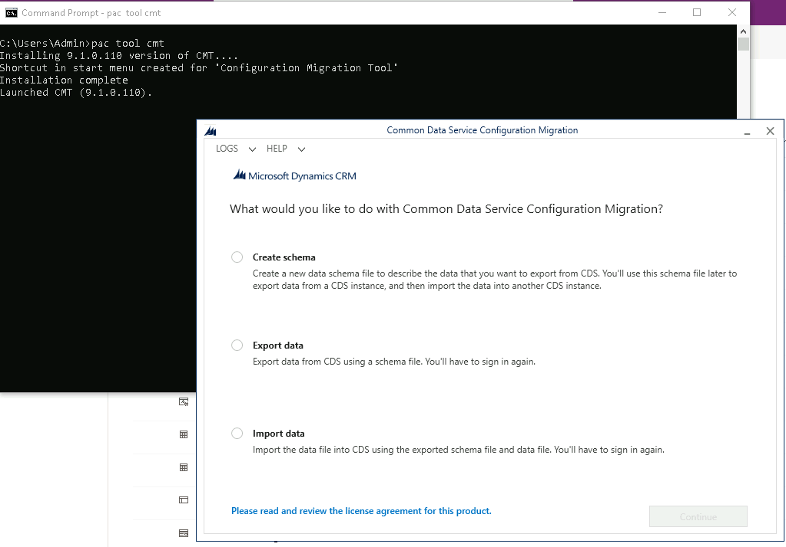
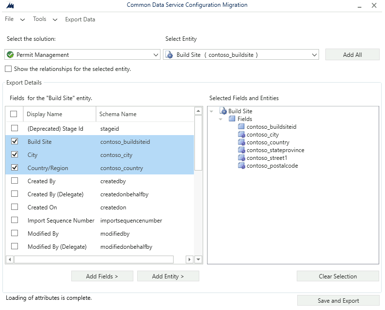
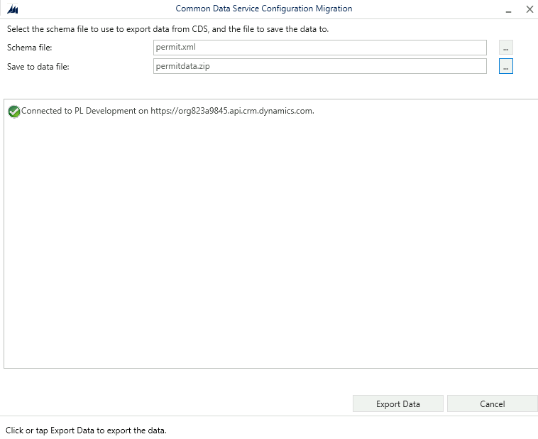
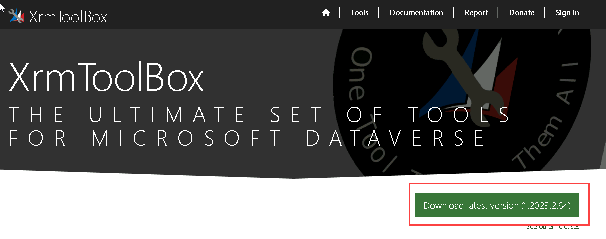
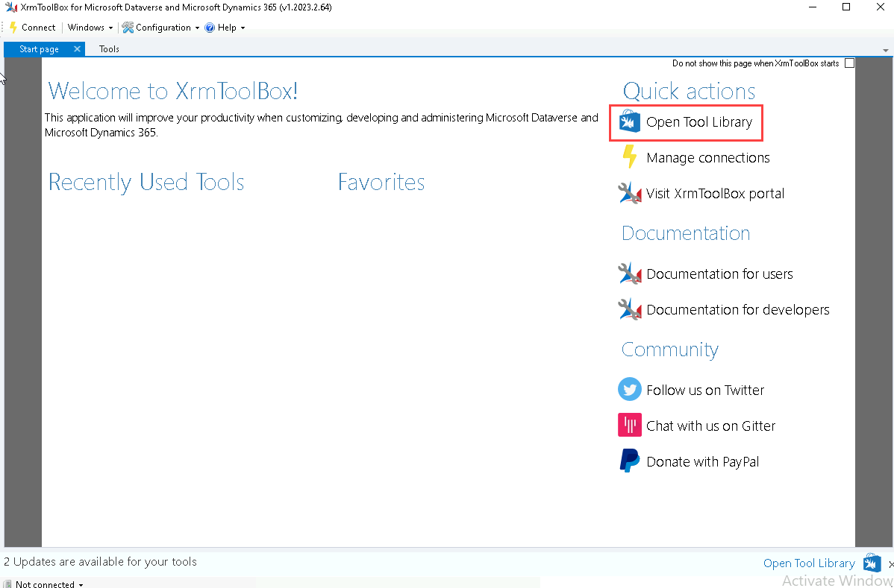
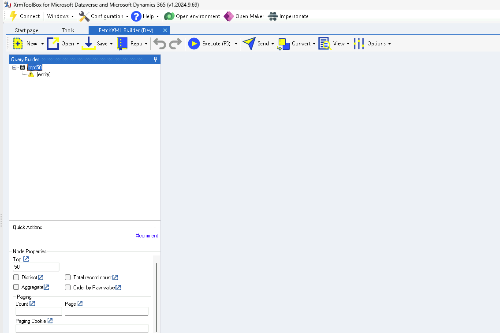
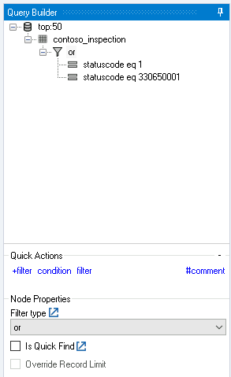

---
lab:
    title: 'Lab 4: Power Platform tools'
    module: 'Module 3: Introduction to developing with Power Platform'
---

# Practice Lab 4 - Power Platform tools

## Scenario

As we continue to build our solution, we will now install and configure tools used for extending the Power Platform with code.

## Prerequisites

The following software must have been installed:

- .Net Framework
- Visual Studio Community Edition 2022 v17.10.5 or higher
- Visual Studio Code
- Power Platform CLI

## High-level lab steps

We will install and configure the following tools:

- Configuration Migration Tool
- XrmToolBox

## Things to consider before you begin

- Which tools do you require?
- Which IDE(s) do you require?

## Starter solution

A starter solution file for this lab can be found in the  C:\Labfiles\L04\Starter folder.

## Exercise 1: Configuration Migration Tool

**Objective:** In this exercise, you will copy reference data between environments.

### Task 1.1: Export data from Development

1. Open a Command Prompt.
1. Launch the Configuration Migration Tool with the following command.

   ```dos
   pac tool cmt
   ```

   

1. Select **Create schema** and select **Continue**.
1. Select **Office 365** for *Deployment Type*.
1. Check **Display list of available organizations**.
1. Check **Show Advanced**.
1. Enter your tenant credentials.

   

1. Select **Login**.

   

1. Select your **Development** environment and select **Login**.
1. Select the **Permit Management** solution.
1. Select the **Build Site** table under *Select Entity*.
1. Select **Build Site, City, Country/Region, State/Province, Street Address, ZIP/Postal Code** columns.
1. Select **Add Fields >**.

   

1. Select the **Permit Type** table under *Select Entity*.
1. Select **Name, Permit Type, Require Inspections, Require Size** columns.
1. Select **Add Fields >**.
1. Select **Save and Export**.
1. Enter `permit.xml` and select **Save**.
1. Select **Yes** to export the data.
1. Select the ellipses **...** next to **Save to data file**.
1. Enter `permitdata.zip`.
1. Select **Save**.

   

1. Select **Export Data**.
1. Select **Exit**.

### Task 1.2: Import data to Production

1. Open the Command Prompt.
1. Run the command `pac tool cmt`.
1. Select **Import data**
1. Select **Continue**.
1. Select **Office 365** for *Deployment Type*.
1. Check **Display list of available organizations**.
1. Check **Show Advanced**.
1. Enter your tenant credentials.
1. Select **Login**.
1. Select your **Production** environment and click **Login**.
1. Select the ellipses **...** next to **Zip File**.
1. Select the **permitdata.zip** file you created in the previous task and click **Open**.
1. Select **Import data**
1. Select **Exit**.
1. Close the Configuration Migration Tool window.

## Exercise 2: Community tools

**Objective:** In this exercise, you will use FetchXmlBuilder in the XrmToolBox to find inspections with status reason New request or Pending.

### Task 2.1: Install XrmToolBox

1. Navigate to XrmToolBox `https://www.xrmtoolbox.com`

   

1. Download the latest version of **XrmToolBox**.
1. Right click on the *XrmToolBox.zip* file and select **Properties**.
1. Select **Unblock** and **Apply**.
1. Extract the XrmToolBox.zip file to a folder.
1. Run **XrmToolBox.exe** from the folder.

   

1. Select **Open Tool Library**.
1. Search for `fetchxml` and select **FetchXML Builder by Jonas Rapp**.

   

1. Select **Install**.
1. Select **Close**.
1. Search for `trace` and select **Plugin Trace Viewer by Jonas Rapp**.
1. Select **Install**.
1. Select **Close**.
1. Close the *Tool Library* tab.

### Task 2.2: FetchXML query

1. Select the **Tools** tab in XRMToolBox.
1. Search for `fetchxml` and select **FetchXML Builder**.
1. Select **Yes** to *Do you want to connect to an organization first?*.
1. Select **Open Connection Manager**.
1. Select **Create a new connection**.
1. Select **Microsoft Login Control**.
1. Click **Open Microsoft Login Control**.
1. Select **Office 365** for *Deployment Type*.
1. Check **Display list of available organizations**.
1. Check **Show Advanced**.
1. Enter your tenant credentials.
1. Click **Login**.
1. Select your **Development** environment and select **Login**.
1. Enter `Dev` for Name and select **Finish**.
1. Select **Close**.
1. Select the **Dev** connection.
1. Select **OK**.
1. Select **Continue**.

   

1. Click on the **(entity)** node.
1. Select **contoso_inspection** in the Entity name drop down.
1. Click on **filter**.
1. Select **statuscode** in the Attribute drop down.
1. Select **Equal** in the Operator drop down.
1. Select **New Request** in the Value drop down.
1. Click on **+condition**.
1. Select **statuscode** in the Attribute drop down.
1. Select **Equal** in the Operator drop down.
1. Select **Pending** in the Value drop down.
1. Click on the **filter** node.
1. Select **or** in the Filter type drop down.

   

1. Select **View** and then select **FetchXML**. The FetchXML should look like the following query.

   ```xml
   <fetch top="50">
     <entity name="contoso_inspection">
       <filter type="or">
         <condition attribute="statuscode" operator="eq" value="1" />
         <condition attribute="statuscode" operator="eq" value="330650001" />
       </filter>
     </entity>
   </fetch>
   ```

1. Select **Execute (F5)**. You should see a list of inspection records.

1. Select **Convert** and then select **Power Automate Parameters**. The filter should look like the following

   ```odata
   (statuscode eq 1 or statuscode eq 330650001)
   ```
