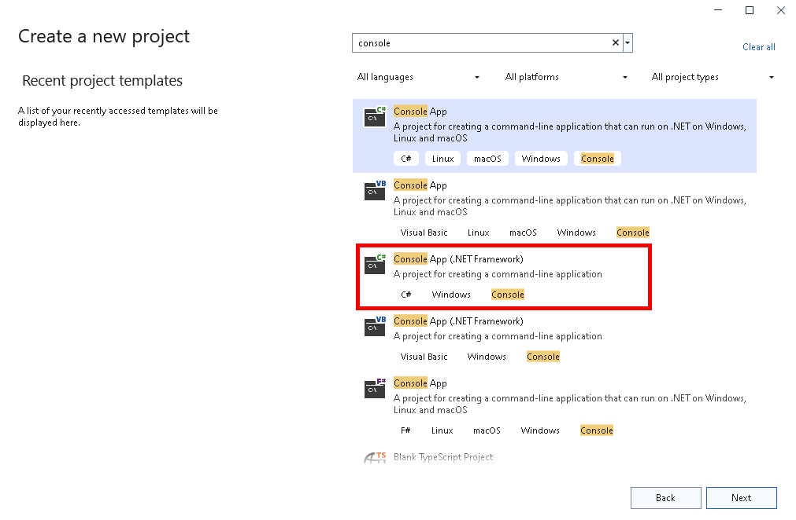
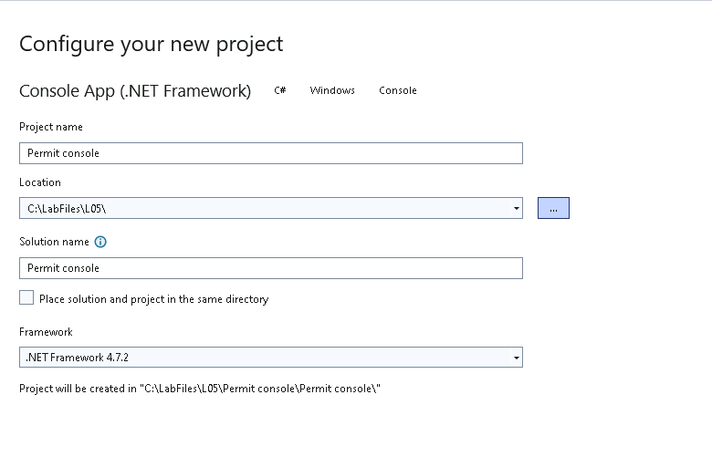

---
lab:
    title: 'Lab 5: Power Platform APIs'
    module: 'Module 3: Introduction to developing with Power Platform'
---

# Practice Lab 5 - Power Platform APIs

## Scenario

As we continue to build our solution, we will now perform basic operations with the Dataverse APIs.

## High-level lab steps

We will use the following APIs

- Organization Service

## Things to consider before you begin

- What endpoints do you need?
- Which IDE(s) do you require?

## Starter solution

A starter solution file for this lab can be found in the  C:\Labfiles\L05\Starter folder.

## Resources

Complete code files for this lab can be found in the  C:\Labfiles\L05\Resources folder.

## Exercise 1: Organization Service

**Objective:** In this exercise, you will use the Organization Service to access data in Dataverse.

### Task 1.1: Organization Service endpoint

1. Open the Permit Management solution.

   - Navigate to the `https://make.powerapps.com`
   - Make sure you are in the Development environment.
   - Select **Apps**.
   - Select the **Permit Management** app, select the **ellipsis (...)** and select **Play**.
   - Copy the Dataverse URL before main.aspx excluding final /.

     

### Task 1.2: Create Console app

> [!NOTE]
> The virtual machine used in the lab environment has Visual Studio 2019 Community Edition installed. The labs are have been verified against this version of Visual Studio. If you are using a different version or edition of Visual Studio, the steps may differ.

1. Start Visual Studio

   - Launch Visual Studio 2022.

     

   - Select **Sign in** and use your Tenant credentials.
   - Select **Start Visual Studio**.

1. Create a new .NET console app project.

   - Select **Create a new project**.
   - Search for `console`.

     

   - Select **Console App (.NET Framework)**.
   - Select **Next**.
   - Enter `Permit console` for Project Name.
   - Change the location to **C:\LabFiles\L05**.
   - Select **.NET Framework 4.7.2**.

     

   - Select **Create**.

1. Add Dataverse assemblies.

   - In Solution Explorer, right-click the *Permit console project* and select **Manage NuGet Packages...**.
   - Select the **Browse** tab.
   - Search for `CrmSdk` and select the **Microsoft.CrmSdk.CoreAssessmblies** NuGet package.
   - Select **Install**.
   - Select **OK**.
   - Select **I Accept**.
   - Search for `CrmSdk` and select the **Microsoft.CrmSdk.XrmTooling.CoreAssembly** NuGet package.
   - Select **Install**.
   - Select **OK**.
   - Select **I Accept**.
   - Close the **NuGet: Permit console** tab.

1. Replace the using statements at the top of Program.cs with the following.

   ```csharp
   using System;
   using System.ServiceModel;
   using Microsoft.Crm.Sdk.Messages;
   using Microsoft.Xrm.Sdk;
   using Microsoft.Xrm.Sdk.Metadata;
   using Microsoft.Xrm.Sdk.Query;
   using Microsoft.Xrm.Tooling.Connector;
   ```

   > [!IMPORTANT]
   > When copying and pasting code into Visual Studio in the Virtual Machine, Intellisense may add or replace code. You should open Notepad and paste into Notepad first, and then copy and paste into Visual Studio.

1. Remove the Program class in Program.cs.

1. Replace the code in Program.cs with the following code.

   ```csharp
   class Program
   {
       static public void Main(string[] args)
       {
           Console.Title = "PL400.Permit.Console";
           Console.WriteLine("Permit console : Start");

           string userName = "admin@M365x99999999.onmicrosoft.com";
           string password = "password";
           string url = "https://orgNNNNNNNN.crm.dynamics.com";

           string connectionString = "AuthType=OAuth;Username=" + userName + ";Password='" + password + "';Url=" + url + ";AppId=51f81489-12ee-4a9e-aaae-a2591f45987d;RedirectUri=app://58145B91-0C36-4500-8554-080854F2AC97;LoginPrompt=Auto";

           try
           {
               Console.WriteLine("Connect using XRM Tooling");
               CrmServiceClient crmSvc = new CrmServiceClient(connectionString);
               if (crmSvc.IsReady)
                   Console.WriteLine("Connected");
               else
               {
                   throw new Exception("Failed to connect");
               }

               Console.WriteLine("Version={0}", crmSvc.ConnectedOrgVersion);
               Console.WriteLine("Organization={0}", crmSvc.ConnectedOrgUniqueName);

               Console.WriteLine("Retrieve current user");
               Guid currentuserid = ((WhoAmIResponse)crmSvc.Execute(new WhoAmIRequest())).UserId;
               Entity systemUser = (Entity)crmSvc.Retrieve("systemuser", currentuserid, new ColumnSet(new string[] { "firstname", "lastname" }));
               Console.WriteLine("Logged on user is {0} {1}.", systemUser["firstname"], systemUser["lastname"]);

               // Data Operations


               Console.WriteLine("Permit console : End");
               // Pause the console so it does not close.
               Console.WriteLine("Press the <Enter> key to exit.");
               Console.ReadLine();
           }
           catch (FaultException<Microsoft.Xrm.Sdk.OrganizationServiceFault> ex)
           {
               Console.WriteLine("Error: {0}", ex.Message);
           }
           catch (System.Exception ex)
           {
               Console.WriteLine("Error: {0}", ex.Message);
           }
       }
   }
   ```

1. Add your tenant credentials in the connection string.

   > [!NOTE]
   > If there is a semi-colon in your password add single quotes around the whole password.

1. Add your Dataverse URL to the connection string.

   > [!NOTE]
   > The Dataverse URL should be similar to https://orgNNNaNNNN.crm.dynamics.com

   > [!IMPORTANT]
   > The URL should not have the / character as the end.

1. Build the project.

   - Select the **Save** icon.
   - In Solution Explorer, right-click the *Permit console project* and select **Build**.
   - The Build should succeed with 0 errors.

1. Run the app.

   - Select the **Start** icon.
   - The output will look similar to the following:

     

1. Press the **Enter** key.
1. Select **File** and **Exit**.

### Task 1.3: Data operations

1. Start Visual Studio.

   - Launch Visual Studio 2019 or 2022.
   - Select **Permit console.sln** under Open recent.

1. Create permit.

   - In program.cs, add the following code under the Data Operations comment.

     ```csharp
     Console.WriteLine("Create permit");
     Entity newPermit = new Entity("contoso_permit");
     newPermit["contoso_name"] = "Organization Service Permit";
     newPermit["contoso_newsize"] = 1000;
     newPermit["contoso_startdate"] = DateTime.Now;
     Guid permitid = crmSvc.Create(newPermit);
     Console.WriteLine("Permit={0}", permitid.ToString());
     ```

1. List inspections.

   - In program.cs, add the following code under the Data Operations comment.

     ```csharp
     Console.WriteLine("Retrieving inspections");
     QueryExpression inspectionsQuery = new QueryExpression
     {
         EntityName = "contoso_inspection",
         ColumnSet = new ColumnSet(false)
     };
     inspectionsQuery.ColumnSet.AddColumn("contoso_permit");
     inspectionsQuery.ColumnSet.AddColumn("contoso_name");
     inspectionsQuery.Criteria.AddCondition("statuscode", ConditionOperator.Equal, 330650001);
     inspectionsQuery.Distinct = true;
     EntityCollection inspections = crmSvc.RetrieveMultiple(inspectionsQuery);
     Console.WriteLine("Number of Pending Inspections=" + inspections.Entities.Count.ToString());
     foreach (Entity inspection in inspections.Entities)
     {
         EntityReference permit = (EntityReference)inspection["contoso_permit"];
         Console.WriteLine("Inspection {0} {1} {2}", permit.Id.ToString(), permit.Name, inspection["contoso_name"]);
     }
     ```

1. Build the project.

   - Select the **Save** icon.
   - In Solution Explorer, right-click the *Permit console* project and select **Build**.
   - The Build should succeed with 0 errors.

1. Run the app.

   - Select the **Start** icon.
   - The output will look similar to the following:

     

1. Press the **Enter** key.
1. Select **File** and **Exit**.
